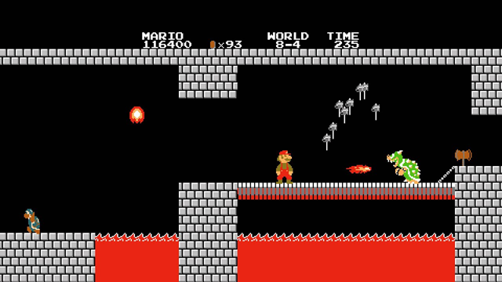

## Exercício - argumentos em linha de comando



### Fase I

1. O que faz o programa abaixo?

```python
linhas = 6
colunas = 3

for linha in range(linhas):
    print("#" * colunas)
```

2. Modifique o programa para que os valores das linhas e colunas sejam recebidos pela linha de comando

### Fase II


Você vai escrever um programa que desenha na tela uma pirâmide como as do jogo Mario Bros.

Seu programa deve receber a `quantidade de degraus` da pirâmide como parâmetro pela linha de comando.

Por exemplo:

```cmd
python mario.py 5
```

Uma chamada como essa deve resultar na seguinte saída:

```
#
##
###
####
#####
```

Esta é uma pirâmide com 5 degraus.

### Fase 3

Acrescente as seguintes restrições ao programa:

- O programa deve recusar-se a gerar uma pirâmide com `0 degraus`
- O programa deve recusar-se a gerar uma pirâmide com mais `mais de 10 degraus`
- O programa pode receber um segundo parâmetro **opcional** que representará o caractere usado para desenhar a pirâmide. Exemplo:
    ```
    python mario.py 5 *
    ```
    A saída deve ser:
    ```
    *
    **
    ***
    ****
    *****
    ```
